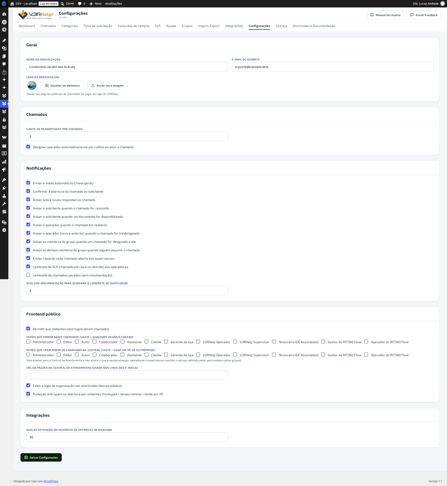
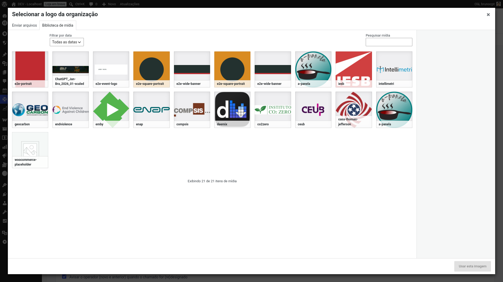

# Configurações
{: .no_toc }

Em **V3RHelp! > Configurações** ficam os ajustes gerais do sistema, organizados em grupos.

  
Nesta página

- TOC
{:toc}

---

## Geral (a identidade da organização)

- **Nome da organização** — aparece no painel e no **cabeçalho dos e-mails**.
- **E-mail de suporte** — usado como remetente das mensagens automáticas.
- **Logo da organização** — enviada para a biblioteca de mídia; aparece nas páginas públicas
  de chamado e no **topo dos e-mails**. Você pode **enviar um arquivo novo** ou clicar em
  **Escolher da biblioteca** para reaproveitar uma imagem já enviada ao site (a biblioteca de
  mídia padrão do WordPress abre para você escolher).

{: .dica }
> Use **Escolher da biblioteca** quando a logo da organização já foi enviada antes — no tema do
> site, em outro plugin, ou numa tentativa anterior aqui mesmo. Evita duplicar o mesmo arquivo
> na biblioteca de mídia com nomes diferentes.

{: .importante }
> Preencher o **nome, o e-mail e a logo** dá aos e-mails e às páginas a cara da sua
> organização. Quem recebe um chamado confia mais numa mensagem que parece vir de "você" do
> que de um sistema genérico — e isso reduz e-mails ignorados como se fossem spam.

## Chamados

- **Limite de reaberturas por chamado** — quantas vezes um chamado resolvido pode ser reaberto.
- **Designar operador automaticamente por rodízio ao abrir o chamado** — quando **ligado**
  (padrão), todo chamado novo já sai com um operador, escolhido por rodízio entre os elegíveis
  da categoria. **Desligado**, os chamados abrem **sem operador**, para a equipe designar à mão.

{: .importante }
> O limite de reaberturas evita que um único chamado vire uma conversa infinita. Quando o
> limite é atingido, o sistema abre **automaticamente** um novo chamado vinculado — o que
> mantém o histórico organizado sem perder a nova mensagem.

{: .dica }
> Deixe a **designação automática** ligada se você usa rodízio por categoria e quer que nada
> fique sem dono. Desligue se prefere que um supervisor **triagem** os chamados e distribua
> manualmente.

## Notificações

A **chave geral** liga ou desliga os e-mails automáticos. Abaixo dela, você controla **cada
tipo** de aviso:

- Confirmar a abertura do chamado ao solicitante
- Avisar sobre novas respostas
- Avisar o solicitante quando o chamado for resolvido
- Avisar o operador quando o chamado for reaberto
- **Avisar o operador (novo e anterior) quando o chamado for (re)designado**
- **Enviar cópia de cada chamado aberto aos supervisores** — todo supervisor recebe uma cópia
  de acompanhamento quando um chamado é aberto (sem duplicar quem já é o solicitante ou o
  operador). Vem **ligado**
- **Lembrete de SLA** (chamado em risco ou vencido) aos operadores
- **Lembrete de chamados parados (inatividade)** — e, ao lado, **quantos dias** sem
  movimentação disparam o lembrete

{: .atencao }
> **"Confirmar a abertura do chamado ao solicitante" não cobre quem abre chamado sem ter
> conta no site.** Essa chave liga e desliga o aviso para quem **está logado**; quem não tem
> conta recebe o e-mail com o link de acompanhamento **sempre**, mesmo com esta chave
> desligada — porque, para ele, esse e-mail é a única forma de voltar ao próprio chamado. Vale
> também para chamados abertos por uma [integração externa](/modulos/integracoes/) em nome de
> alguém sem conta.

{: .importante }
> Os **lembretes** são o que impede um chamado de ser esquecido. O aviso de SLA faz a equipe
> agir antes de estourar o prazo; o lembrete de inatividade cutuca chamados que ficaram
> parados — sugerindo, inclusive, marcar como Resolvido o que já foi concluído. Ajuste os
> dias para o ritmo real da sua equipe: um número baixo demais vira spam; alto demais deixa
> chamados esfriarem.

{: .dica }
> Os lembretes rodam por uma tarefa agendada (a cada hora) do WordPress. Se os e-mails
> automáticos não estiverem chegando, confira com o responsável técnico se o **WP-Cron** do
> site está ativo.

## Frontend público

- **Permitir que visitantes (sem login) abram chamados** — habilita a abertura por quem não
  tem conta (com nome + e-mail e magic link).
- **Papéis que podem abrir chamados** — se vazio, qualquer usuário logado pode; senão,
  restringe aos papéis escolhidos.
- **URL da página da Central de Atendimento** — o endereço da página onde você publicou o
  shortcode `[v3rhelp_central]`. É usado para montar os **links dos e-mails**.
- **Exibir a logo da organização nas telas públicas** — liga ou desliga a logo no topo dos
  shortcodes/blocos públicos. Vem **ligada**; desligue se preferir as páginas de atendimento
  sem a logo (por exemplo, quando a página do site já tem o cabeçalho da marca).
- **Proteção anti-spam na abertura por visitantes** — vem **ligada**. Sem captcha e sem
  incomodar quem é gente de verdade: barra robôs por trás dos panos (campo-isca invisível,
  tempo mínimo de preenchimento e um limite de aberturas por origem). Só afeta **visitantes
  sem login**; quem já está logado passa direto.

{: .dica }
> **Desde a v1.30.0**, se você deixar este campo **vazio**, o V3RHelp tenta adivinhar sozinho:
> procura, entre as páginas **publicadas** do site, uma que tenha o shortcode ou o bloco da
> Central, e usa o endereço dela nos e-mails.

{: .atencao }
> A busca automática só ajuda quando **encontra** uma página com a Central. Não encontrando
> nenhuma, o V3RHelp cai de volta para o **endereço principal do site** — e aí o botão
> "Acompanhar meu chamado" leva a pessoa para a **home**, não para o chamado dela. Preencher
> este campo é o único jeito de garantir o link certo sem depender de o sistema achar a
> página sozinho.

{: .atencao }
> Liberar a abertura para **visitantes** é ótimo para acessibilidade, mas expõe o formulário a
> spam. Por isso a **proteção anti-spam** (acima) já vem ligada — deixe-a ativa quando permitir
> visitantes. Ela é invisível para o público e não pede captcha.

## Quem enxerga quais chamados

Por padrão, cada pessoa que abre um chamado (pela Central ou por um formulário do site) só
enxerga **os próprios** chamados — nunca os de outra pessoa. Esta seção deixa você abrir uma
exceção, papel por papel do WordPress, para quem precisa acompanhar tudo sem fazer parte da
equipe de suporte.

- **Papéis com visão de todos os chamados** — marque, entre os papéis do WordPress existentes
  no site, quais devem enxergar **todos os chamados** na Central de Atendimento, em vez de só os
  próprios. Vem **desmarcado para todos os papéis** — o comportamento padrão continua sendo cada
  um ver apenas o que abriu.

{: .importante }
> Pense num coordenador ou gestor que precisa **acompanhar tudo** o que está sendo atendido, sem
> virar operador nem entrar na fila de designação — ele não vai resolver chamados, só
> supervisionar. Marcar o papel dele aqui resolve isso sem mexer na Equipe: continua sendo um
> usuário comum do site, só que com visão ampliada na Central.

{: .atencao }
> Este controle **não muda o que a equipe de suporte enxerga**. Operadores e supervisores
> continuam regidos pelas permissões e pelos grupos do módulo [Equipe](equipe.html) e
> [Grupos](grupos.html) — dar visão ampliada a um papel do WordPress não amplia nem reduz o
> escopo de quem já está na equipe. E o acesso por **magic link** enviado por e-mail continua
> restrito ao chamado daquele link especificamente, mesmo que o papel do destinatário tenha
> visão ampliada marcada aqui.

{: .exemplo }
> A organização tem o papel personalizado "Coordenação". Marcando "Coordenação" nesta lista,
> qualquer usuário com esse papel passa a ver todos os chamados na Central — mesmo sem nunca ter
> sido adicionado à Equipe. Um coordenador que só precisa relatório de andamento não precisa mais
> pedir para um supervisor exportar dados para ele.
