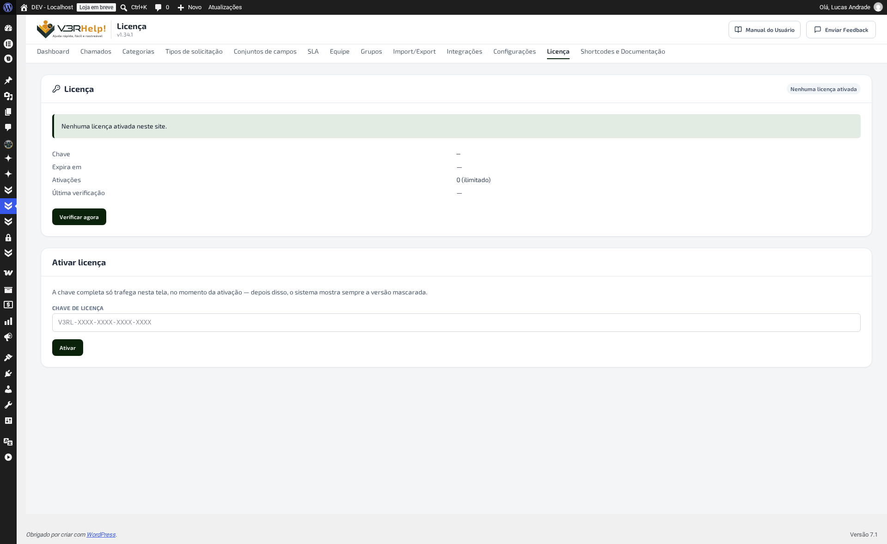

# Licença
{: .no_toc }

Em **V3RHelp! > Licença** você ativa a chave que libera as **atualizações automáticas** do
plugin.

  
Nesta página

- TOC
{:toc}

---

## Por que isso importa

O V3RHelp **funciona sem licença** — não existe recurso pago que trave o sistema de
chamados. A licença serve só para uma coisa: **liberar as atualizações automáticas**,
inclusive as que corrigem bugs e falhas de segurança. Sem ativar, o site continua rodando
na versão instalada, mas **não recebe nada de novo** — nem os ajustes urgentes.

{: .importante }
> Ative a licença logo depois de instalar o plugin. Não é intuitivo, mas **licença não
> ativada = zero atualização**, e isso vale mesmo quando a versão atual tem um problema já
> corrigido numa versão mais nova.

## Como ativar

1. Abra **V3RHelp! > Licença**.
2. Cole a **chave de licença** (formato `V3RL-XXXX-XXXX-XXXX-XXXX`) no campo **Chave de
   licença**.
3. Clique em **Ativar**.

{: .atencao }
> A chave completa só aparece nesta tela, no momento da ativação. Depois disso, o sistema
> sempre mostra a versão mascarada (ex.: `V3RL-XXXX-...-B428`) — guarde a chave original
> (e-mail de compra, gerenciador de senhas) caso precise reativar em outro site.

## Os campos

| Campo | O que significa |
|---|---|
| **Status** | *Nenhuma licença ativada*, *Ativa* ou o motivo de recusa. |
| **Chave** | A chave mascarada, depois de ativada. |
| **Expira em** | Data-limite da assinatura; passada ela, as atualizações voltam a parar. |
| **Ativações** | Quantos domínios já usam essa chave, sobre o limite contratado. |
| **Última verificação** | Quando o plugin conferiu, junto ao servidor da V3RTECH, se a licença continua válida. Use **Verificar agora** para atualizar na hora. |

## Ativações por domínio

Uma mesma licença vale para **vários sites**, até o limite contratado — cada domínio ocupa
uma vaga. Para trocar de servidor, use **Desativar licença** no site antigo antes de
ativar no novo: **desativar libera a vaga** na hora.

{: .dica }
> Ambiente de teste/homologação reconhecido como tal pelo servidor de licenças **não
> consome cota** — pode manter a licença ativada ali sem gastar uma ativação do plano.

## Quando dá errado

| Situação | O que fazer |
|---|---|
| Chave recusada | Confira se copiou a chave inteira, sem espaços, e se não trocou `O` por `0` ao digitar à mão. |
| Limite de ativações atingido | Desative a licença em um site que não usa mais essa chave, ou contrate mais ativações. |
| Licença expirada | Renove a assinatura e clique em **Verificar agora** para atualizar sem esperar a checagem automática. |
| Servidor de licenças indisponível | O plugin segue funcionando com a última verificação válida; tente de novo em alguns minutos, e fale com o suporte se persistir por mais de um dia. |

{: .exemplo }
> Sua equipe atende chamados em três sites da organização (produção, um site regional e um
> de eventos). Se o plano contratado tem 3 ativações, cada um desses sites ocupa uma vaga —
> ao encerrar o site de eventos, desative a licença nele antes de ativar num site novo.
